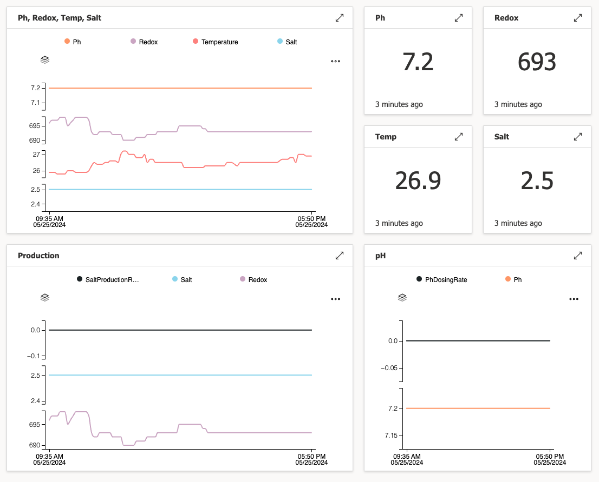

# BayrolConnect
C# library to connect to Automatic Salt using bayrol-poolaccess.de and/or MQTT

It includes a Dockerfile to build a docker image that can publish your device-data to Azure IoT Central:



## Known Issues
Since I needed this to work before my vacation, it isn't as clean & robust as I would
like it to be - the WebConnector should be more reliable than the MqttConnector,
but both are designed to throw exceptions when something goes wrong, instead of trying
to recover from it - I simply rely on the container to be restarted for now.

## Supported Devices
I've written this for Bayrol's Automatic Salt device, but the WebConnector should be easily adaptable
to other devices. I don't know if other devices also support MQTT, but if they do we'd probably need
to make the MqttConnector more generic.

## What about sending commands via MQTT?
I haven't implemented this since I don't need it, but it should be easy to add.

## Usage
You can use the library for your own project, or use the provided application to connect
to Azure IoT Central.

To do this, just pass a json via the environment variable `CONFIG` to the container, which
contains the following fields:

```json
{
    "User": "<bayrol-poolaccess user>",
    "Password": "<bayrol-poolaccess password>",
    "Cid": "<cid extracted from the url to your device>",
    "IdScope": "<azure device id-scope>",
    "DeviceId": "<azure device id>",
    "PrimaryKey": "<azure device primary key",
    "UseMqtt": true
}
```
UseMqtt = true will use the MqttConnector, otherwise the WebConnector will be used.
The WebConnector is probably more reliable, but the MqttConnector gives you more data;
see [AutomaticSaltDeviceData.cs](BayrolLib/AutomaticSaltDeviceData.cs).
vs. [ExtendedAutomaticSaltDeviceData.cs](BayrolLib/ExtendedAutomaticSaltDeviceData.cs).

## Contributing
I'm happy to accept pull requests, so if you feel that something is missing... go ahead :)